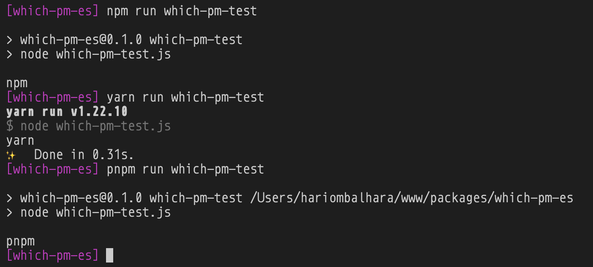

# Identify which PackageManager is being used
It has a very simple ESModule based API. Supports pnpm, npm, yarn

## Usage
```JavaScript
import whichPm from 'which-pm-es'
console.log(whichPm);
```

## Demo

